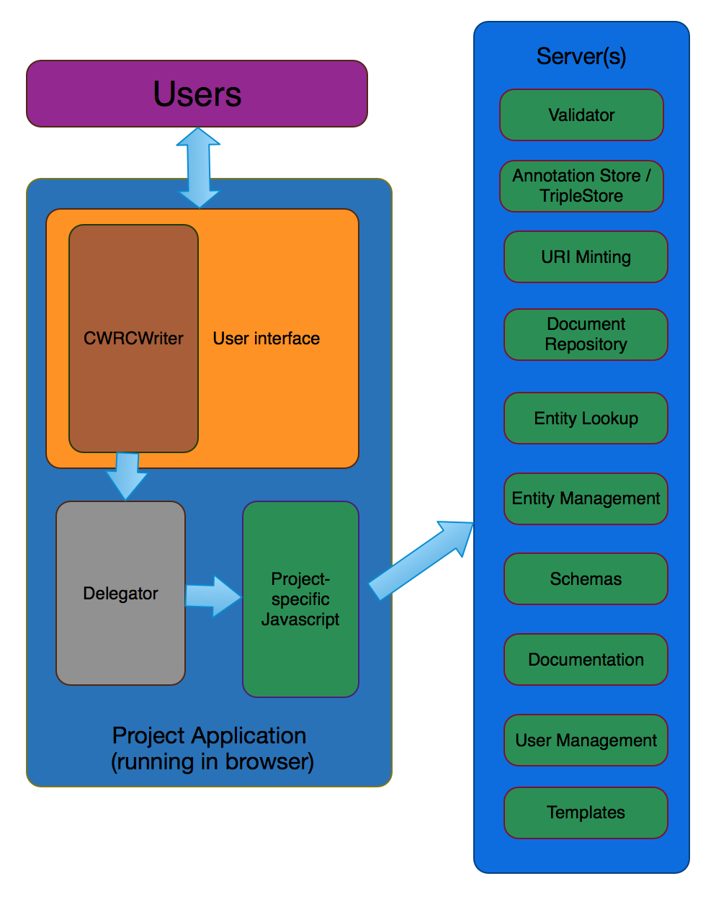
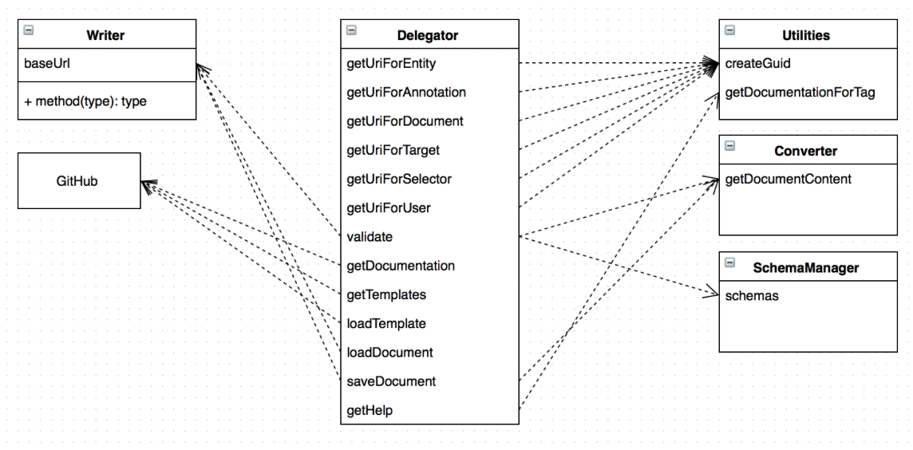

CWRC-Writer
===========

The Canadian Writing Research Collaboratory (CWRC) is developing an in-browser text markup editor (CWRC-Writer) for use by collaborative scholarly editing projects.


## Table of Contents

1. [Overview](#overview)
1. [Setup](#setup)
1. [Configuration](#overview)
1. [Usage](#usage)
1. [Customization](#customization)
1. [Demo](#demo)
1. [Contributing](#contributing)
1. [License](#license)


## Overview

CWRCWriter is a wysiwyg text editor for in-browser XML editing and stand-off RDF annotation.  The editor is a JQuery customization of the [TinyMCE](http://www.tinymce.com) editor.  CWRCWriter requires several (not provided) supporting services: 

  * document store, to list/retrieve/save/delete/update XML documents
  * annotation store, to list/retrieve/save/delete/update RDF annotations
  * XML validation service
  * authentication/authorization, as needed
  * entity management service, to lookup/add/edit entities (people,places,events)
  * XML schemas 
  * template service, to provide predefined XML templates 
  * documentation service, to provide help for various functions

The services are configured through a 'delegator' class to which the CWRCWriter makes predefined calls without any knowledge of the underlying implementation, allowing easier substitution of your own document store, etc.  If you have existing server-side services, you'll create a delegator to call out to your services.  You may alternatively create a delegator that implements some or all services in-browser.
Most of the work in setting up CWRCWriter for your project will be implementing a delegator, and the corresponding services if you don't already have them.  



**[Back to top](#table-of-contents)**

## Setup

### RequireJS

CWRC-Writer uses RequireJS to load its files. The dependencies setup occurs in https://github.com/cwrc/CWRC-Writer/blob/development/src/js/config.js. See https://github.com/cwrc/CWRC-Writer/blob/development/src/editor_dev.htm for a working example.

#### Set RequireJS baseUrl

```
require.config({baseUrl: 'js'});
```

#### Load the initial dependencies
```
require(['jquery', 'knockout'], function($, knockout) {
    window.ko = knockout; // requirejs shim isn't working for knockout
    
    require(['writer',
             'delegator',
             'jquery.layout',
             'jquery.tablayout'
    ], function(Writer, Delegator) {
        $(function() {
            // initialize the Writer
        });
    });
});
```

#### Initialize the Writer and any modules
```
writer = new Writer(config);
writer.init('editor');
writer.event('writerInitialized').subscribe(function(writer) {
  // load modules then do the setup
  require(['modules/entitiesList','modules/relations','modules/selection',
           'modules/structureTree','modules/validation'
  ], function(EntitiesList, Relations, Selection, StructureTree, Validation) {
    // initialize modules and do layout
  });
});
```

### Customize Layout

See https://github.com/cwrc/CWRC-Writer/blob/development/src/js/layout.js for an example of module initialization and layout.

### Delegate to your services

The bulk of the work in setting up the CWRCWriter is in the delegator.  



**[Back to top](#table-of-contents)**

## Configuration

### Writer Config options

* `config.cwrcRootUrl`: String. An absolute URL that should point to the root of the CWRC-Writer directory. <b>Required</b>.
* `config.mode`: String. The mode to start the CWRC-Writer in. Can be either `xml` or `xmlrdf`.
* `config.allowOverlap`: Boolean. Should overlapping entities be allowed initially?.
* `config.project`: String. Denotes the current project. Not currently used.
* `config.schemas`: Object. A map of schema objects that can be used in the CWRC-Writer. Each entry should contain the following:
  * `name`: The schema title.
  * `url`: An url that links to the actual schema (RELAX NG) file.
  * `cssUrl`: An url that links to the CSS associated with this schema.
  * `schemaMappingsId`: The directory name associated with this schema. This is used to load appropriate mapping and dialogs files from the schema directory: https://github.com/cwrc/CWRC-Writer/tree/development/src/js/schema
* `config.cwrcDialogs`: Object. Contains various urls for use by the [CWRC-Dialogs](https://github.com/cwrc/CWRC-Dialogs). See [writerConfig.js](https://github.com/cwrc/CWRC-Writer/blob/development/src/js/writerConfig.js) for an example.
* `config.buttons1`, `config.buttons2`, `config.buttons3`: String. A comma separated list of plugins that will be set in the toolbars in the CWRC-Writer. Some possible values are: `addperson, addplace, adddate, addorg, addcitation, addnote, addtitle, addcorrection, addkeyword, addlink, editTag, removeTag, addtriple, viewsource, editsource, validate, savebutton, loadbutton`.

### Configuration within documents

The CWRCWriter can be configured for individual documents by including configuration information in the documents themselves:  

1.  XML/RDF mode.  The default mode isXML & RDF with no overlap.

This can be overridden by a cw:mode setting in the RDF:

<rdf:Description rdf:about="http://localhost:8080/editor/documents/null">
    <cw:mode>0</cw:mode>
</rdf:Description>

where allowable values for cw:mode are:

0 = XML & RDF
1 = XML
2 = RDF

**[Back to top](#table-of-contents)**

## Usage

### XML/RDF modes

**[Back to top](#table-of-contents)**

## Customization

The CWRCWriter menus and layout can be customized.

**[Back to top](#table-of-contents)**

## Demo

**[Back to top](#table-of-contents)**

## Contributing

Please contact us, or open an issue.

**[Back to top](#table-of-contents)**

## License

#### (The License)


**[Back to top](#table-of-contents)**


